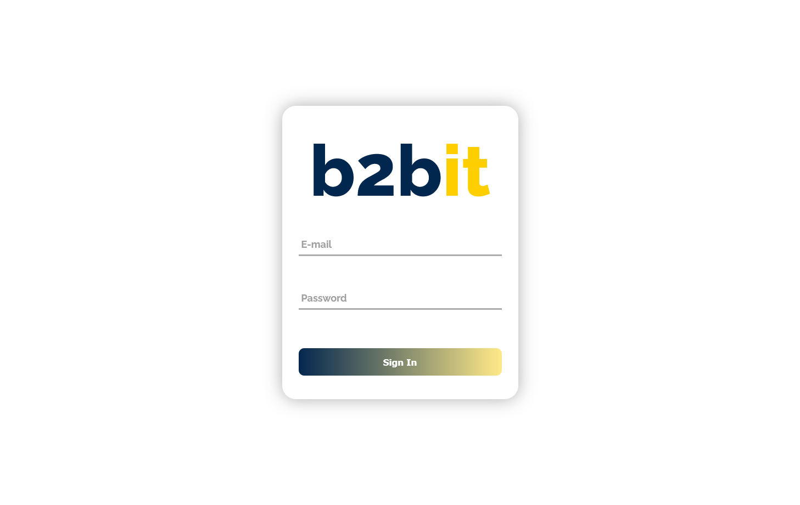
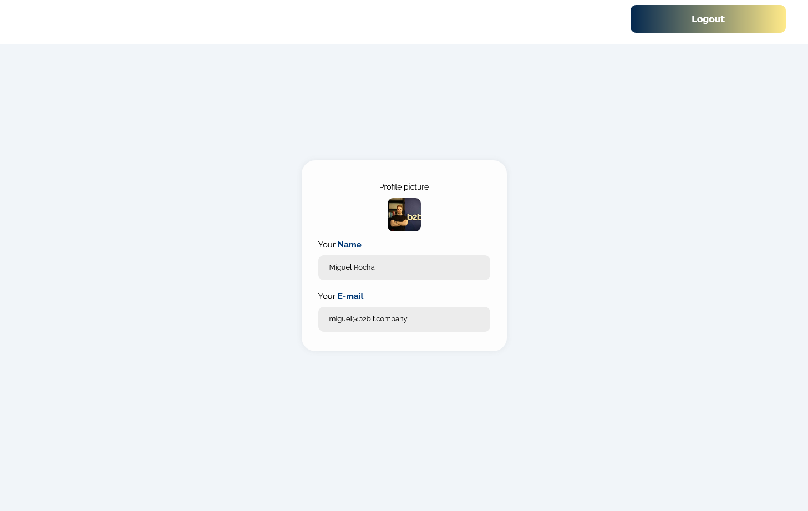

# Login Project 

- Sign in page:

- Profile page:

---

Made with:

- Typescript
- React
- React-Router-Dom v6
- HTML/CSS
- Styled Components
- Context API
- Axios

---

To run this project, you must have Node installed in your machine.

1. First, if you don't have Git installed, download the zip file and extract him. If you have, clone the repository:

    > git clone https://github.com/rafaelfreire09/Login-Project.git

2. Inside the project, install the necessary dependencies to run.

    > npm install

    > yarn install

3. To run:

    > npm start
    
    > yarn start

4. Open http://localhost:3000/signin and/or http://localhost:3000/profile to view it in the browser.

5. Use `miguel@b2bit.company` as email and `ctLbtGWLtg` as password to access.